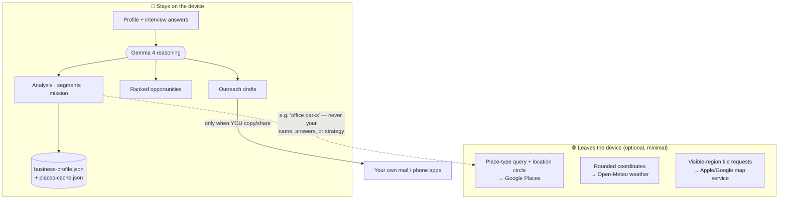

# Data flow & provenance

Expansion Scout's core promise: **Google Maps discovers places. Gemma reasons about
those places privately, on your device.** This file maps every input to where it is
processed, what is stored, and what (if anything) leaves the device. The same
information is available in-app under the **On-device AI** badge → *Your data*.

## The whole flow at a glance



## Every input, end to end

| Input | Collected when | Processed where | Stored where | Transmitted? |
| --- | --- | --- | --- | --- |
| Business profile (name, type, city, radius, goals, capabilities, availability) | Profile setup / edits | On device (Gemma + deterministic reasoning) | Device only — `business-profile.json` in the app's document directory (localStorage on web) | **Never** |
| Interview answers | AI Conversation screen | On device — Gemma decides the next question and distills the profile locally | Merged into the cached profile; raw transcript held in memory for the session only | **Never** |
| Gemma's analysis (focus, strengths, target segments) | Analysis screen | Generated on device | Cached on device with the profile so Home can show a real mission on relaunch | **Never** |
| Ranked opportunities (scores, reasons, evidence, risks, confidence) | Growth-plan pipeline | Generated on device | In memory for the session | **Never** |
| Outreach drafts | Outreach screen | Generated on device | In memory; leaves only when **you** copy/share a draft yourself | Only by your explicit copy/share action |
| Place lookups (optional) | Growth-plan pipeline, only when a Google Places key is configured | Google Places Text Search | Normalized results in memory + the latest set cached on device (`places-cache.json`, ≤7 days) so reopening the app doesn't re-search | **Yes — but only** a place-type query (e.g. "property management offices", from Gemma's `mapsQuery`) and a location-bias circle. Never your name, goals, answers, analysis, or drafts. Returned fields used: name, address, location, type, rating, review count, phone, website. |
| City geocoding (optional) | Saving the profile with a Places key configured | Google Places | Coordinates cached with the profile on device | **Yes** — the city string only |
| Today's weather (optional) | Daily Mission screen | Open-Meteo (no key, no account) | In memory for the screen | **Yes** — rounded coordinates only; nothing else |
| Map tiles (Growth Plan) | Viewing the growth-plan map on a device | Apple Maps (iOS) / Google Maps (Android) render tiles for the visible region — the standard OS map service; the app never requests device location (the center comes from the stored profile) | Tiles cached by the OS map SDK | **Yes** — tile requests for the visible map region only; none of your profile, answers, or reasoning. Offline / on web / on map failure it degrades to a schematic rendered locally from coordinates |

## What the Google Places request contains — exactly

```
POST https://places.googleapis.com/v1/places:searchText
{ "textQuery": "<place type>", "maxResultCount": 4,
  "locationBias": { "circle": { "center": {lat, lng}, "radius": <service radius> } } }
```

`textQuery` is a *kind of place* (from Gemma's target segments or category defaults),
never free text from the owner's answers. There is no account, no user id, no
analytics SDK, and no backend of ours anywhere in the app.

## Failure behavior (observable in-app)

- **No Places key / offline / API error** → discovery degrades to targets *derived
  from your own profile* (`src/services/localCandidates.ts`); the map badge reads
  "Targets from your profile" instead of "Places via Google".
- **Gemma unreachable / timeout / malformed JSON** → the deterministic on-device
  ranker answers; every result carries `InferenceMeta.source` (`gemma` vs
  `fallback`), surfaced in the UI, so provenance is never faked.
- **Forget this business** (Profile screen) deletes the on-device cache; deleting
  the app removes everything.

## Boundaries in code

- `src/services/places.ts` — the only file that talks to Google; raw responses are
  normalized to `PlaceCandidate` before anything (including Gemma) sees them.
- `src/services/gemma.ts` — the only file that talks to a model; validates all
  output against closed schemas and stamps provenance (`InferenceMeta`).
- `src/services/profileStore.ts` — the only persistence; a single JSON file on the
  device.
