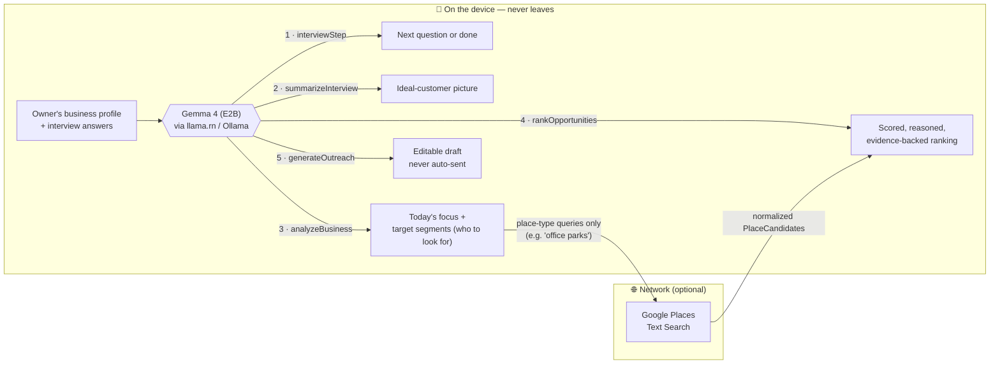
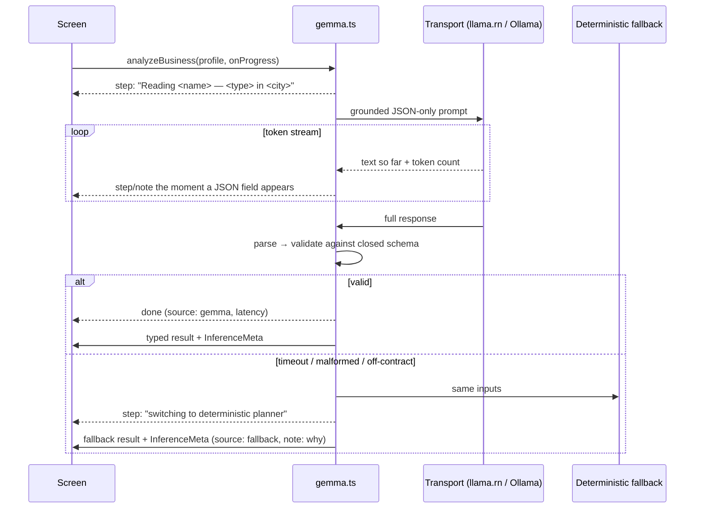
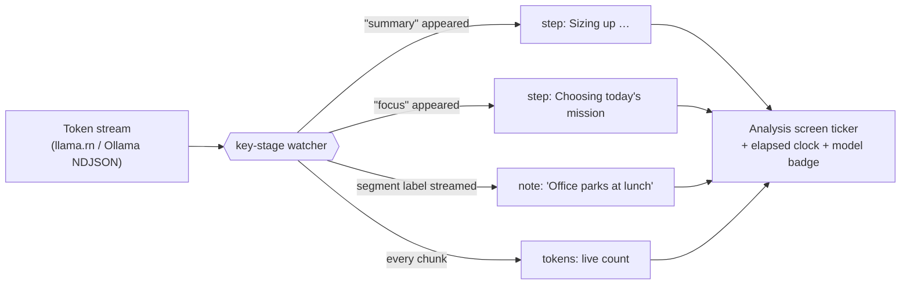
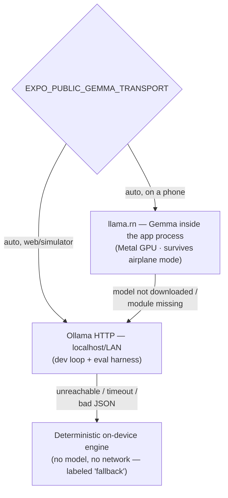

# How Gemma reasons in Expansion Scout

A quick, judge-friendly tour of exactly what the model does, where it runs, and
how its output is kept honest. (Data handling: [DATA_FLOW.md](./DATA_FLOW.md) ·
on-device setup: [ON_DEVICE.md](./ON_DEVICE.md) · metrics:
[EVALUATION.md](./EVALUATION.md).)

The one-line architecture: **Google Places discovers public places. Gemma 4
reasons about them privately, on the device.** The map is a tool; the reasoning
is the product.

## The big picture

Five distinct reasoning jobs, one model, one contract. Each job sends a grounded
prompt, demands strict JSON against a closed schema, and has a deterministic
on-device fallback — so the flow completes even with no model and no network.

## The reasoning jobs

| # | Call | Gemma decides | Grounded in |
| --- | --- | --- | --- |
| 1 | `interviewStep` | Whether it can already picture the ideal customer — else the single most useful next question | The conversation so far |
| 2 | `summarizeInterview` | Who the ideal customer is, how to recognize them, **where they physically gather**, how to reach them | The full transcript (identity/geo come from the stored profile, never the model) |
| 3 | `analyzeBusiness` | Today's one mission + 3–5 **target segments**, each classified into a closed customer taxonomy with a literal Maps query | Profile + inferred customer |
| 4 | `rankOpportunities` | Score, confidence, reasons, evidence, risk, best time, and a do-it-today action per place | Only the normalized candidates we hand it — it cannot add places |
| 5 | `generateOutreach` | A channel- and tone-shaped draft that leads with what the prospect gets | Profile + the selected opportunity's real attributes only |

## One call, end to end (validate-or-fallback)

Every call goes through the same orchestration in `src/services/gemma.ts` — the
only file in the app that talks to a model:

Key properties:

- **Strict JSON contract.** Prompts demand a single JSON value; transports
  constrain generation to JSON (`format: "json"` / `response_format`); output is
  parsed and validated against typed shapes with closed enums. Free-text strays
  are *coerced* onto the closed sets (`coerceCategory`, `coerceSegmentType`,
  `coerceReach`) or rejected.
- **Provenance on every answer.** Results carry
  `InferenceMeta { source, model, latencyMs, validated, note }`, surfaced in the
  UI — a judge can always see whether real Gemma or the fallback answered.
- **Bounded time.** Every call has a timeout; no loading state can hang.

## The progress you see is the model actually thinking

The "thinking" screens are not an animation. Transports stream tokens as they
are generated (llama.rn partial-completion callback; Ollama NDJSON read
progressively). `gemma.ts` watches the accumulating JSON and emits a
`ReasoningEvent` **the moment the model reaches each field of its answer**:

So when the demo shows *"Deciding exactly who to look for…"* and segment names
ticking in, that is Gemma emitting those fields **right then**, on the device —
with a live token counter and wall clock to prove it. If the model is
unavailable, the same channel honestly reports the switch to the deterministic
planner. (The UI paces reveals by a few hundred ms for readability; it never
invents a step.)

Chain-of-thought is never shown — only stage labels and the validated output
(reasons, evidence, risks, confidence).

## Where the model runs (transport ladder)

Same interface, same prompts, same validation on every rung — the UI only ever
learns which rung answered via `InferenceMeta.source`.

## Why the model can't lie to you

- **No invented places.** Rankings are joined back to our candidate ids;
  unknown ids are dropped (`validateRanked`).
- **No invented evidence.** A model-written evidence line survives only if it
  overlaps the data we actually gave the model; known facts (distance, rating)
  are always appended (`groundedEvidence`).
- **No identity drift.** Business name, type, and coordinates always come from
  the stored profile — the model only fills the soft fields
  (`validateProfile`).
- **No invented outreach facts.** Drafts are grounded in the selected
  opportunity; prompts forbid invented names, numbers, and discounts, and the
  owner edits + copies manually — nothing is ever auto-sent.
