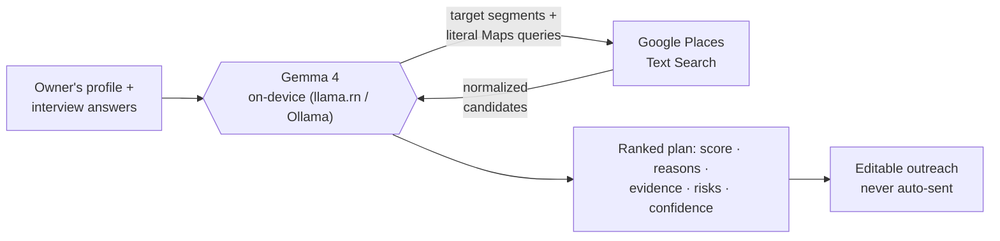

# Expansion Scout

**Find where your business should grow next.**

Expansion Scout is a private, **on-device AI business growth consultant** for
field-working local business owners — taco trucks, mobile detailers, pressure
washers, pet groomers, landscapers. Instead of sitting at a desk with a CRM, the
owner opens the app and gets a **daily mission**: one clear growth goal, the best
places nearby to pursue it, why each one matters, and ready-to-send outreach — all
reasoned locally by **Gemma 4**.

Built for the **"On-Device AI with Gemma 4"** hackathon track.

> **Google Maps discovers places. Gemma reasons about those places privately.**
> Your business strategy never leaves your device.

## Demo flow

```
Launch → Daily Mission → AI Conversation → Analysis → Today's Growth Plan
      → Opportunity Details → Generate Outreach → Today's Plan
```

## How it works



Gemma does five real reasoning jobs (adaptive interview, customer inference,
business analysis, opportunity ranking, outreach drafting) behind one strict
JSON contract with schema validation and a deterministic on-device fallback.
**[GEMMA_REASONING.md](./GEMMA_REASONING.md)** has the full picture with
diagrams — including how the "thinking" screen streams real reasoning stages
live from the model's token stream.

## Tech

- Expo SDK 57 · React Native 0.86 · React 19 · TypeScript (strict)
- Expo Router (file-based, typed routes)
- Gemma 4 via a local inference adapter (`src/services/gemma.ts`)
- Google Places behind a safe adapter (`src/services/places.ts`)
- react-native-maps (Apple Maps on iOS, key-free) with a fully offline schematic
  fallback for web / airplane mode / map failure

The app runs **without any API keys or network**: discovery degrades to targets
derived from the owner's own profile, and reasoning degrades to a deterministic
on-device engine — both honestly labeled in the UI. Aside from optional map
lookups, the whole flow survives airplane mode.

## Getting started

```bash
npm install
npx expo start
```

Then open in an iOS simulator, Android emulator, Expo Go, or a development build.

> **Expo has changed** — read the versioned docs at
> https://docs.expo.dev/versions/v57.0.0/ before writing Expo code.

## Where to go next

- **[CLAUDE.md](./CLAUDE.md)** — product vision, brand, privacy framing, architecture
  boundaries. Read this first.
- **[GEMMA_REASONING.md](./GEMMA_REASONING.md)** — exactly how Gemma reasons: the five
  reasoning jobs, validate-or-fallback flow, live progress streaming, grounding guards.
- **[IMPLEMENTATION_PLAN.md](./IMPLEMENTATION_PLAN.md)** — target structure, domain
  models, and the ordered ticket backlog.
- **[JUDGING_RUBRIC.md](./JUDGING_RUBRIC.md)** — the 100-point hackathon rubric, our
  self-assessment per category, and the success criteria the demo must prove.

## Status & honest limitations

This is a hackathon build optimized for a polished, demoable vertical slice, not
production. On-device Gemma inference is accessed through a thin adapter with a
deterministic local fallback; when the model is unavailable the app uses seeded data
and templates and labels output accordingly. No auth, database, or backend.
